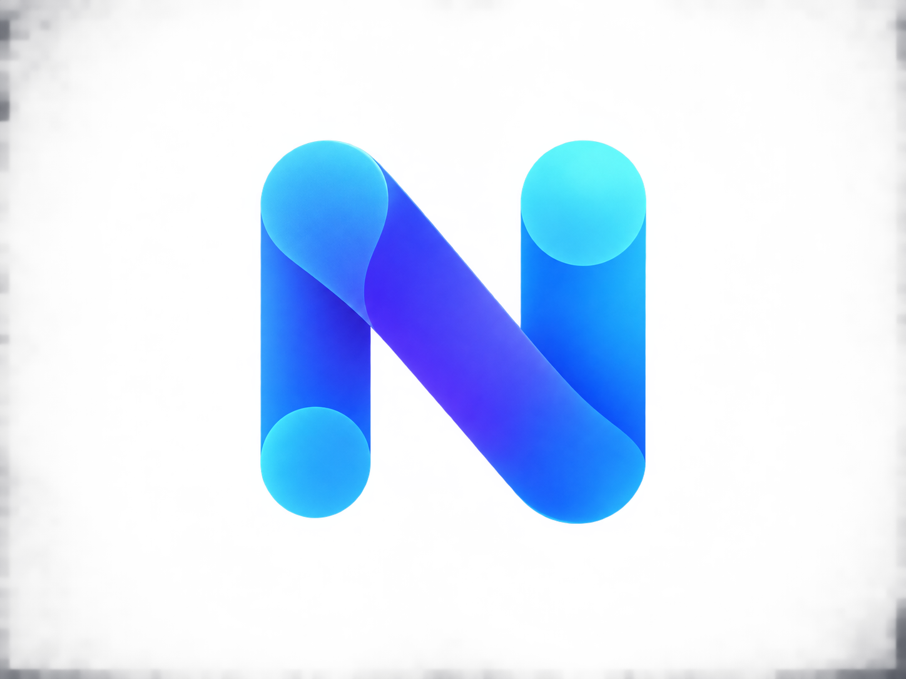

<p align="center">
  
</p>

<h1 align="center">Nexus</h1>

<p align="center">
An autonomous English AI agent built from scratch, designed to complete multi-step tasks
using reasoning, tools, memory, web research, code execution, and document retrieval.
</p>

> Nexus is currently under active development.

## Status

| Stage | Status |
|-------|--------|
| Tokenizer | Done: 50,000-token byte-level BPE with 32 special tokens (see [`tokenizer/`](tokenizer/)) |
| Tokenizing the pretraining data | Next |
| Pretraining | Planned |
| Supervised fine-tuning for tool use | Planned |
| Agent runtime (tools, memory, planner) | Planned |
| Evaluation | Planned |

## Project Structure

```
nexus-agent/
├── config/
├── tokenizer/
├── model/
├── training/
├── agent/
│   ├── planner/
│   ├── executor/
│   ├── memory/
│   └── tools/
├── rag/
├── data/
├── evaluation/
├── inference/
└── scripts/
```