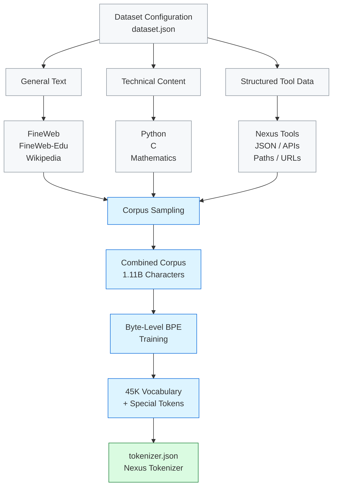

# Nexus Tokenizer

A custom Byte-Level BPE tokenizer built specifically for Nexus,
designed to handle natural English, programming languages,
mathematics, and structured tool interactions.

## Pipeline
## Pipeline

## Corpus

The tokenizer is trained on a 1.11B-character corpus composed of:

- General English web text
- Educational text
- Mathematical content
- Python code
- C code
- Wikipedia
- Nexus tool interactions

## Configuration

- Algorithm: Byte-Level BPE
- Vocabulary: 45,000 tokens
- Context length: 2,048
- Special tokens: ...

## Files

| File | Purpose |
|------|---------|
| dataset.json | Defines tokenizer datasets |
| sample_corpus.py | Samples the training corpus |
| create_nexus_tools_corpus.py | Generates tool-use text |
| train_tokenizer.py | Trains the Byte-Level BPE tokenizer |
