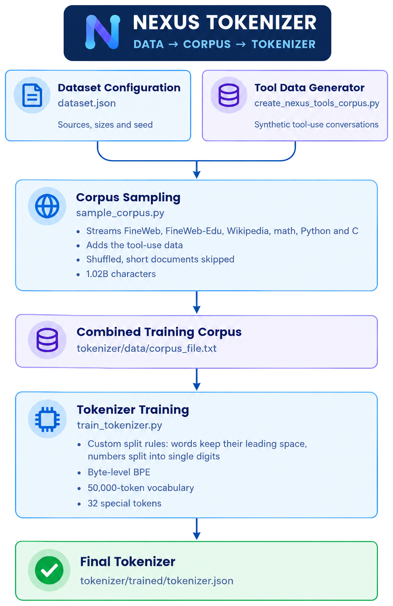

# Nexus Tokenizer

A custom Byte-Level BPE tokenizer built specifically for Nexus,
designed to handle natural English, programming languages,
mathematics, and structured tool interactions (JSON, paths, URLs, command output).

## Pipeline

<p align="center">
  
</p>

## Corpus

The tokenizer is trained on a 1.02B-character corpus:

| Source | Characters | Content |
|--------|-----------:|---------|
| FineWeb | 400M | General English web text |
| FineWeb-Edu | 250M | Educational text |
| Python code | 180M | Python source code |
| Mathematics | 90M | Mathematical web text |
| Wikipedia | 60M | Encyclopedia articles |
| C code | 30M | C source code |
| Nexus tools | 10M | Synthetic tool-use conversations |

Streams are shuffled with a fixed seed (42), and documents shorter than 200
characters are skipped. The corpus is English-only. Datasets are streamed from
Hugging Face and are not redistributed here; see each dataset's page for its license.

## Configuration

- **Algorithm:** Byte-Level BPE
- **Vocabulary:** 50,000 tokens (256 bytes + 32 special tokens + 49,712 merges)
- **Numbers:** split into single digits (`2048` becomes `2 0 4 8`)
- **Words:** each word keeps its leading space (` dog`); punctuation, symbols
  and line breaks are cut as separate pieces
- **Normalization:** none, so decoding gives back the exact original text

### Special tokens

IDs 0 to 31, in this exact order. Never reorder or rename them.

| Tokens | Purpose |
|--------|---------|
| `<pad>` `<bos>` `<eos>` `<unk>` | Padding, document start, document end, unknown |
| `<\|system\|>` `<\|user\|>` `<\|assistant\|>` | Message roles |
| `<\|tool_call\|>` `<\|end_tool_call\|>` | Wrap the JSON of a tool call |
| `<\|tool_result\|>` `<\|end_tool_result\|>` | Wrap the JSON returned by a tool |
| `<\|end_turn\|>` | End of a message |
| `<\|reserved_0\|>` to `<\|reserved_19\|>` | Spare slots for future features |

### Conversation format

```
<|user|>Run the project tests.<|end_turn|>
<|assistant|><|tool_call|>{"name":"run_tests","arguments":{"path":"tests/"}}<|end_tool_call|>
<|tool_result|>{"status":"success","result":{"passed":18,"failed":0}}<|end_tool_result|>
<|assistant|>All 18 tests passed.<|end_turn|>
```

## Files

| File | Purpose |
|------|---------|
| `dataset.json` | Defines the tokenizer corpus (sources, sizes, seed) |
| `sample_corpus.py` | Streams and samples the training corpus |
| `create_nexus_tools_corpus.py` | Generates the synthetic tool-use text |
| `train_tokenizer.py` | Trains the Byte-Level BPE tokenizer |
| `trained/tokenizer.json` | The final tokenizer |

## Rebuild

The corpus (`tokenizer/data/`) is not stored in the repository because of its
size. To recreate everything:

```
python tokenizer/create_nexus_tools_corpus.py
python tokenizer/sample_corpus.py
python tokenizer/train_tokenizer.py
```
